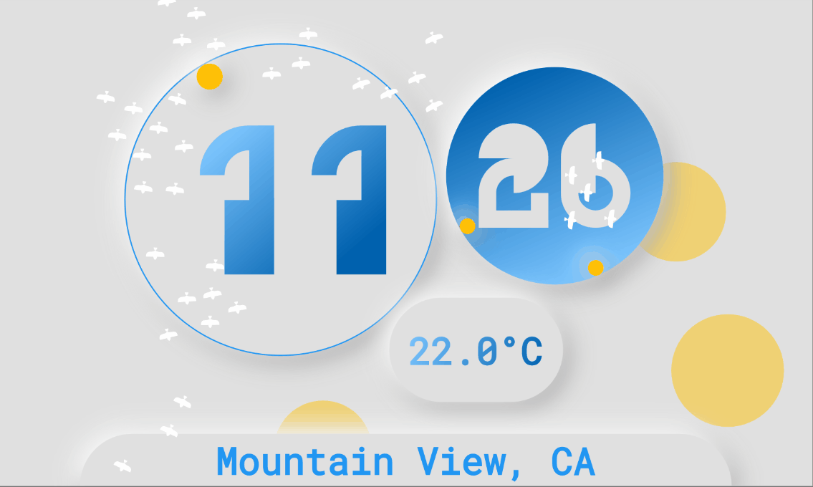
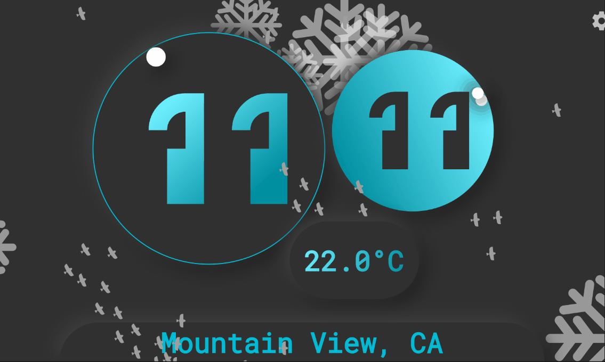
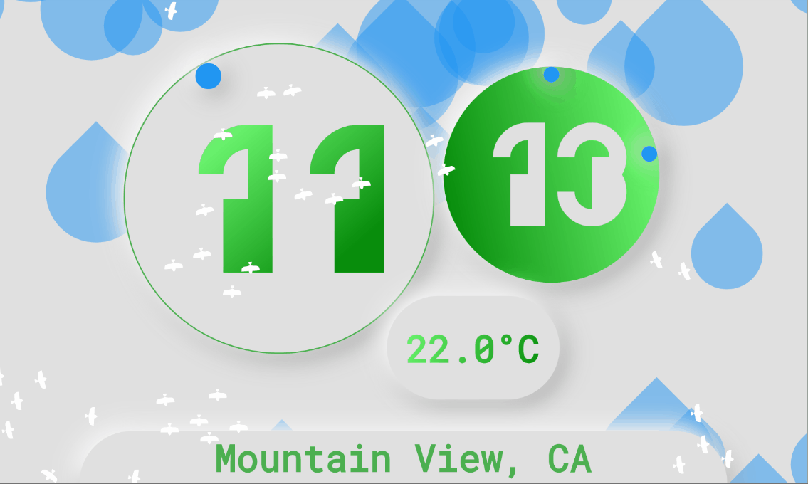
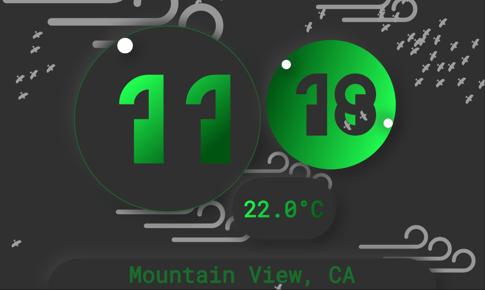
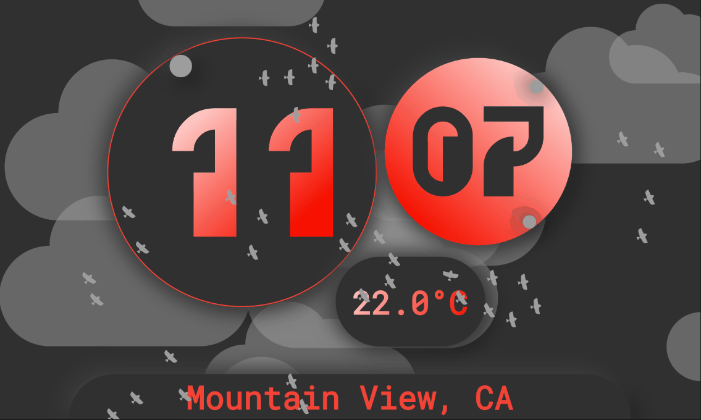
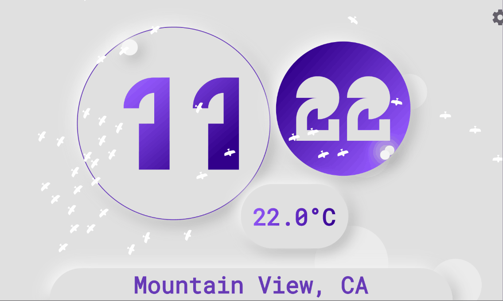

# Sky Globe Clock

Digital (and analog) clock that displays weather conditions similar to a snow globe and  includes bird-oid (boid) flocking.
Gradients on hour and minutes are angled to reflect current position on an analog clock.

light - sunny

dark - sunny

snow

rain

wind

cloudy

storm

foggy
